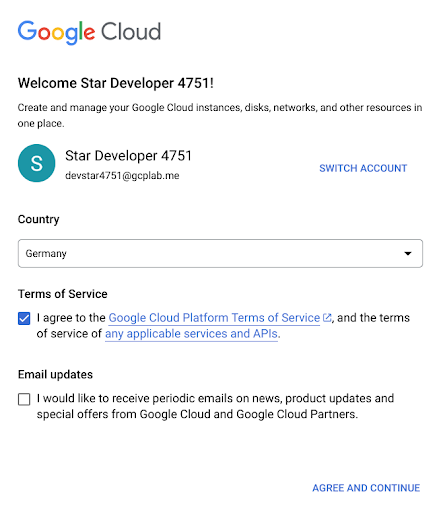
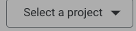
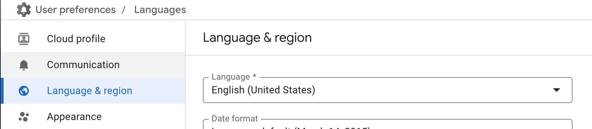

# Logging into Google Cloud

  
  caution

Please follow the below steps exactly as written. Deviating from them has unintended consequences.

Let us set your your Google Cloud Console. Please:

1. Open a new browser window in **Incognito** mode.  
2. Open this handbook in your newly opened incognito window and keep reading; close this window in your main browser window.
3. Open <a href="https://console.cloud.google.com" target="_blank">Google Cloud Console</a> and log in with the provided credentials.
4. Accept the Terms of Services.   

    

5. Choose your **project id**. Click on select a project and select the project ID (example below)  
    

    

    

6. Go to [language settings](https://console.cloud.google.com/user-preferences/languages) and change your language to `English (US)`. This will help our tutorial engine recognize items on your screen and make our table captain be able to help you.

    