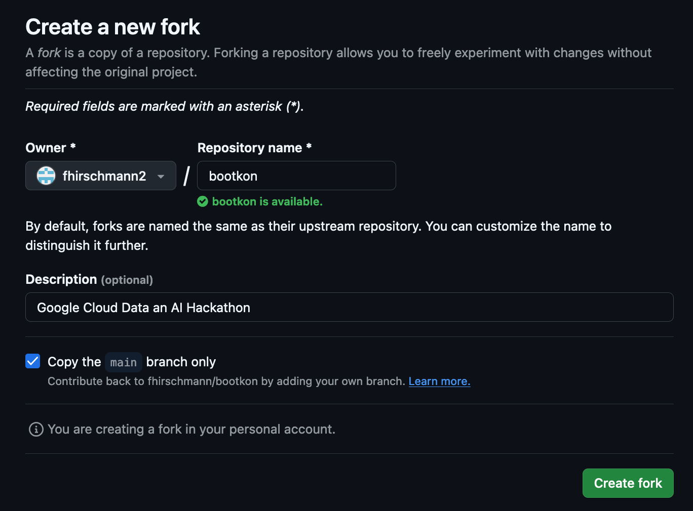
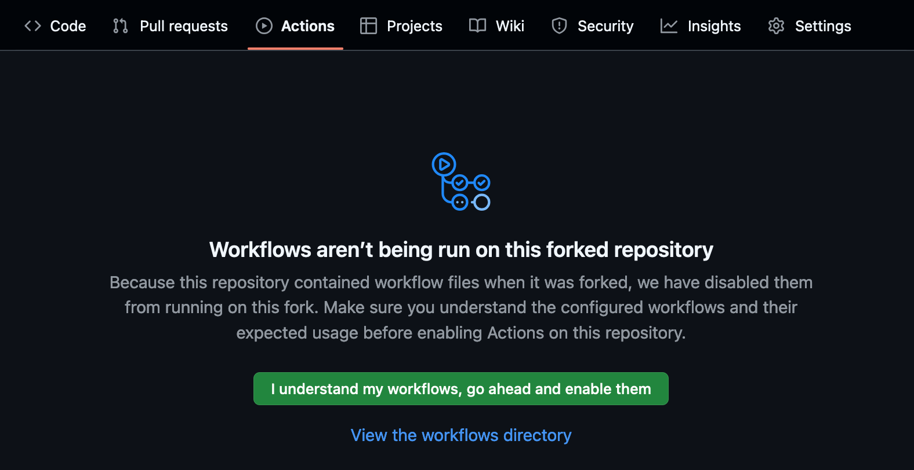
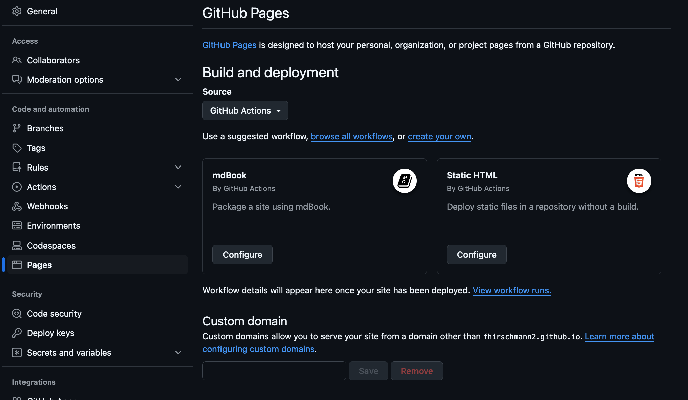
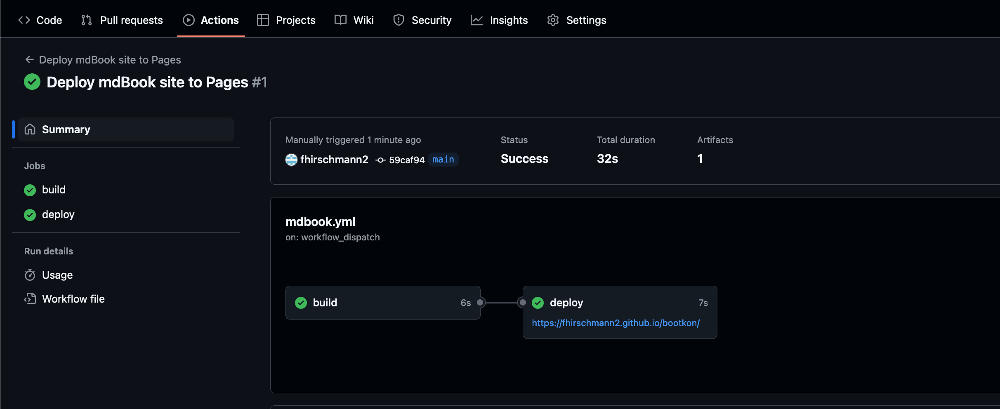

# Forking the GitHub repository

If you want to create your custom version of bootkon, please fork the [repository on GitHub](https://github.com/fhirschmann/bootkon)
using the `fork` button.

Forks by default have GitHub actions disabled. You need to enable them by navigating to the `Actions` tab in the top menu on Github and then press the button to enable it.

You also need to have GitHub Pages enabled so that the action can publish the markdown book as HTML website. Navigate to `Settings` and then `Pages`.
Use the dropdown menu to set the `Source` to `GitHub Actions`. **Do not configure mdBook here** -- the repository already containes an improved mdBook action.

You can now simply push your changes to *your own* GitHub repository to trigger all actions. Once the actions have run, you can see the URL of your handbook
in the `Actions` tab.

