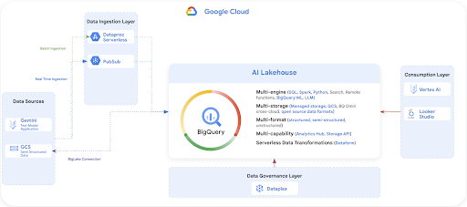

# Use Case 

Your role: As a senior data analytics/AI engineer at an imaginary company called FraudFix Technologies, you will tackle the challenges of making financial transactions safer using machine learning. Your work will involve analyzing vast amounts of transaction data to detect and prevent fraud, as well as assessing customer sentiment regarding the quality of transaction services. You will leverage a unique dataset, which includes auto-generated data by Google Gemini and  public European credit card transactions that have been PCA transformed and anonymized. This dataset will be used to train your models, reflecting real-world applications of GCP Data & AI in enhancing financial safety.

**Data Sources**.  
You’ll start by working with raw data that comes in different formats (csv , parquets). 
Those data files are stored in a github repository. Your first task is to store the raw data into your Google Cloud Storage (GCS) bucket.

**Data Ingestion Layer**  
You will bring this data into your [BigQuery AI Lakehouse](https://services.google.com/fh/files/emails/google-cloud-analytics-lakehouse_.pdf) environment. 
For batch data, you’ll use [Dataproc Serverless](https://cloud.google.com/dataproc-serverless/docs) and [BigLake](https://cloud.google.com/biglake?e=48754805&hl=en). 
For near real-time data, you’ll use [Pub/Sub](https://cloud.google.com/pubsub/docs/overview) to handle data as it comes in. 
Because we want to simulate data ingestion at scale, we will be using the raw data that you have stored in GCS to simulate both batch and real time ingestion.
These tools help you get the data ready for processing and analysis.

**BigQuery AI Lakehouse**
Think of this as the main camp where all your data hangs out. It’s a GCP product called BigQuery, and it’s designed to work with different types of data, whether it’s structured neatly in tables or unstructured like a pile of text documents. Here, you can run different data operations without moving data around.

**Data Governance Layer**
This is where you ensure that your data is clean, secure, and used properly. Using [Dataplex](https://cloud.google.com/dataplex), you’ll set rules and checks to maintain data quality and governance.

**Consumption Layer**   
Once you have your insights, you’ll use tools like [Vertex AI](https://cloud.google.com/vertex-ai) for machine learning tasks and [Looker Studio](https://cloud.google.com/looker-studio) for creating reports and dashboards. This is where you turn data into something valuable, like detecting fraud or understanding customer sentiment.
Your goal is to share the results of your data predictions to your customers in a secure and private way. You will be using Analytics Hub for data sharing.

Throughout the event, you’ll be moving through these layers, using each tool to prepare, analyze, and draw insights from the data. You’ll see how they all connect to make a complete data analytics workflow on the cloud.

## About the data set
The datasets contain transactions made by credit cards in September 2013 by European cardholders, but also augmented by Google Gemini. This dataset presents transactions that occurred over two days, where there are a few hundred fraudulent transactions out of hundreds of thousands of transactions. It is highly unbalanced, with the positive class (frauds) accounting for less than 0.1% of all transactions (subject to testing in your notebooks). It contains only numeric input V* variables which are the result of a PCA transformation. Due to confidentiality issues, the owner of the dataset cannot provide the original features and more background information about the data. 

Features V1, V2, ... V28 are the principal components obtained with PCA, the only features which have not been transformed with PCA are ‘Time' , ‘Feedback’ and ‘Amount'. 

Feature ‘Time' contains the seconds elapsed between each transaction and the first transaction in the dataset. Feature ‘Amount' is the transaction Amount, this feature can be used for example-dependent cost-sensitive learning. Feature ‘Class' is the response variable and it takes value 1 in case of fraud and 0 otherwise. Feature ‘Feedback’ represents customer selection on service quality after submitting the transaction. This feature has been auto-generated by Google Gemini and added to the original dataset. 

During your machine learning experimentation using notebooks, one of the notebook cells will add your Google cloud account email address into the prediction dataset for traceability. This email address is treated as PII data and should not be shared externally outside of Fraudfix. The original dataset has been collected and analyzed during a research collaboration of [Worldline and the Machine Learning Group of ULB](http://mlg.ulb.ac.be) (Université Libre de Bruxelles) on big data mining and fraud detection. If you need more details on current and past projects on related topics are available here  and here.

 