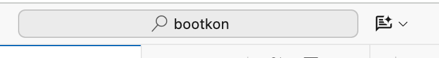

## Lab 1: Environment Setup

<walkthrough-tutorial-duration duration="30"></walkthrough-tutorial-duration>
{{ author('Fabian Hirschmann', 'https://linkedin.com/in/fhirschmann') }}
<walkthrough-tutorial-difficulty difficulty="1"></walkthrough-tutorial-difficulty>
<bootkon-cloud-shell-note/>


In this lab we will set up your environment, download the data set for this Bootkon, put it to Cloud Storage,
and do a few other things.

### Enable services

First, we need to enable some Google Cloud Platform (GCP) services. Enabling GCP services is necessary to access and use the resources and capabilities associated with those services. Each GCP service provides a specific set of features for managing cloud infrastructure, data, AI models, and more. Enabling them takes a few minutes.

<walkthrough-enable-apis apis=
  "storage-component.googleapis.com,
  notebooks.googleapis.com,
  serviceusage.googleapis.com,
  cloudresourcemanager.googleapis.com,
  pubsub.googleapis.com,
  compute.googleapis.com,
  metastore.googleapis.com,
  datacatalog.googleapis.com,
  bigquery.googleapis.com,
  dataplex.googleapis.com,
  datalineage.googleapis.com,
  dataform.googleapis.com,
  dataproc.googleapis.com,
  bigqueryconnection.googleapis.com,
  aiplatform.googleapis.com,
  cloudbuild.googleapis.com,
  cloudaicompanion.googleapis.com,
  artifactregistry.googleapis.com">
</walkthrough-enable-apis>

### Assign permissions

Execute the following script:
```bash
bk-bootstrap
```

But what did it do? Let's ask Gemini while it is running.

1. Open  <walkthrough-editor-open-file filePath=".scripts/bk-bootstrap">`bk-bootstrap`</walkthrough-editor-open-file>.
2. Open Gemini Code Assist


3. Insert ``What does bk-bootstrap do?`` into the Gemini prompt.

Cloud Shell may ask you to select your project and enable the API. Do not worry about missing licenses.

### Download data

Next, we download the data set for Bootkon and put it into Cloud Storage. Before we do that, we create
a bucket where we place the data into. Let's name it ``{{ PROJECT_ID }}-bucket``:
```bash
gsutil mb -l $REGION gs://{{ PROJECT_ID }}-bucket
```

The next command will download the dataset from GitHub and extract it to Cloud Shell:
```bash
wget -qO - https://github.com/fhirschmann/bootkon-data/releases/download/v1.7.1/data.tar.gz | tar xvzf -
```

Let's upload the data to the bucket we just created:
```bash
gsutil -m cp -R data gs://{{ PROJECT_ID }}-bucket/
```

Is the data there? Let's check and open [Cloud Storage](https://console.cloud.google.com/storage/browser/{{ PROJECT_ID }}-bucket). Once you have checked, you may need to resize the window that just opened
to make it smaller in case you run out of screen real estate.

### Create default VPC

The Google Cloud environment we created for you does not come with a Virtual Private Cloud (VPC) network
created by default. Let's create one. If it already exists -- that's ok. 

```bash
gcloud compute networks create default --project=$PROJECT_ID --subnet-mode=auto --bgp-routing-mode="regional"
```

Let's also create/update the subnet to allow internal traffic:

```bash
gcloud compute networks subnets update default --region=$REGION --enable-private-ip-google-access
```

If the command above returned an error about a *visibility check*, please wait two minutes for the permissions to propagate and try again.

Next, create a firewall rule:

```bash
gcloud compute firewall-rules create "default-allow-all-internal" \
    --network="default" \
    --project=$PROJECT_ID \
    --direction=INGRESS \
    --priority=65534 \
    --source-ranges="10.128.0.0/9" \
    --allow=tcp:0-65535,udp:0-65535,icmp
```

### Success

🎉 Congratulations, {{ MY_NAME }}! You've officially leveled up from "cloud-curious" to "GCP aware"! 🌩️🚀

