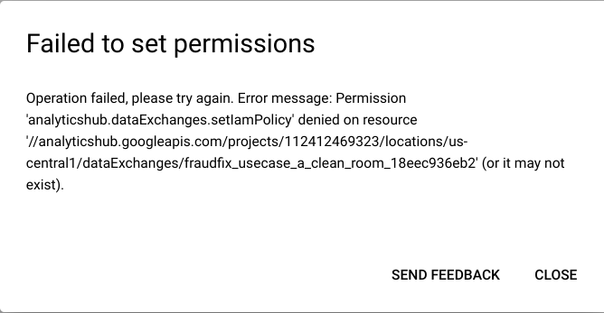
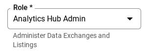
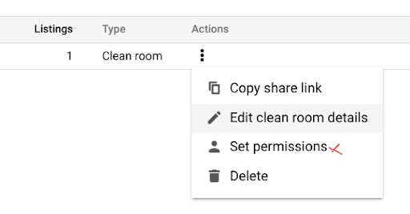
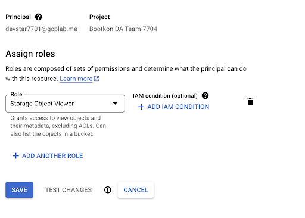
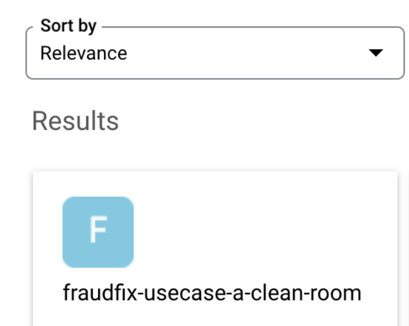
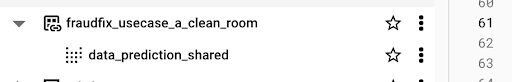
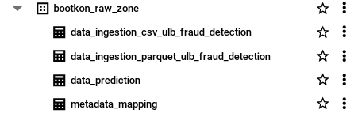

## Lab 6: Analytics Hub



<walkthrough-tutorial-duration duration="45"></walkthrough-tutorial-duration>
{{ author('Cary Edwards', 'https://www.linkedin.com/in/cary-edwards-a3a557a6/') }}
<walkthrough-tutorial-difficulty difficulty="3"></walkthrough-tutorial-difficulty>
<bootkon-cloud-shell-note/>

Within this lab, you will share the machine learning prediction results to the FraudFix customer while keeping the data securely within the provider's storage environment. Here, you will focus on avoiding sharing PII data. 

* We have previously created the fraud detection model predictions.   
* After running the dataplex  data discovery job , we noticed a new BigQuery dataset created called `bootkon_raw_zone` , `data_prediction` biglake table were automatically created by Dataplex discovery jobs.  
* The goal of the **FraudFix** data scientist team  is to share the results of the data prediction with the customer.  
* The customer will use the PCA data and perform reversed PCA in order to get the result of the predictions.  
* The customer will also use the explainability results from the `data_prediction` data to understand why the decisions have been made to flag a given transaction as fraudulent or not.  
* There is a small caveat, the  `data_prediction` biglake table has the email address of the service account or user who has performed the machine learning tasks. This information is considered PII data (Personal Identifiable Information). In addition you should not share the auto generated transaction id that you have added during the machine learning labs.  
* Data clean room within the Data Analytics Hub will allow you to share the data securely and without leaking any PII information.   
* You have been assigned a group of work. Each group member will play the role of a data provider and a data subscriber of the other group members.    
* You are a data publisher and data subscriber. You are publishing the results of your data prediction and you are subscribing to other team member data prediction.  
* Collect the GCP account addresses of the your group members assigned to you, in order to set up privileges and share the data with them.

***

### LAB Section : Hands-on on Analytics Hub (Data Clean Room) capabilities

Steps as Data Publisher :
The Data Publisher in this case is the FraudFix technology. They are providers of data prediction results and model prediction explainability.


1. Create a dataset: `ml_datasets_clean_room`  which is for the Authorized View. Authorized View is always recommended over table for enforcing the [privacy policy](https://cloud.google.com/bigquery/docs/privacy-policies). Note how one of the columns are declared as private and put a limit on the lower limit on the aggregated results.  
   The dataset should be in the same region as `bootkon_raw_zone` dataset that Dataplex has created before.
   
   ```bash
   dataset_name='ml_datasets_clean_room'
   bq mk --location=us-central1 \
      --dataset \
      --description "Shared ml dataset" \
      "$dataset_name"
   ```

2. Define an aggregation threshold analysis rule for a view. An aggregation threshold rule for a view requires a minimum number of distinct entities (e.g., users) in a dataset before statistics are included in query results.  It groups data, counts distinct entities within each group, and only returns groups meeting the minimum threshold. 
   A view that includes this analysis rule can also include the [joint restriction analysis rule](https://cloud.google.com/bigquery/docs/analysis-rules#join_restriction_rules).  
   You can define an aggregation threshold analysis rule for a view in a [data clean room](https://cloud.google.com/bigquery/docs/data-clean-rooms) or with the following statement:  
   
   ```
   CREATE OR REPLACE VIEW {{ PROJECT_ID }}.ml_datasets_clean_room.data_prediction_shared
   OPTIONS(
   privacy_policy= '{"aggregation_threshold_policy": {"threshold": 1, "privacy_unit_column": "service_account_email"}}'
   )
   AS ( SELECT * EXCEPT (transaction_id) FROM `{{ PROJECT_ID }}.bootkon_raw_zone.data_prediction` );
   ```

   THRESHOLD: The minimum number of distinct privacy units that need to contribute to each row in the query results. If a potential row doesn't satisfy this threshold, that row is omitted from the query results.

   PRIVACY\_UNIT\_COLUMN: Represents the privacy unit column. A privacy unit column is a unique identifier for a privacy unit. A privacy unit is a value from the privacy unit column that represents the entity in a set of data that is being protected. You can use only one privacy unit column, and the data type for the privacy unit column must be [groupable](https://cloud.google.com/bigquery/docs/reference/standard-sql/data-types#groupable_data_types). The values in the privacy unit column cannot be directly projected through a query, and you can use only [analysis rule-supported aggregate functions](https://cloud.google.com/bigquery/docs/reference/standard-sql/query-syntax#agg_threshold_policy_functions) to aggregate the data in this column.

3. Try the following query in BigQuery without specifying the without an aggregation threshold 

   ```
   SELECT * 
   FROM `{{ PROJECT_ID }}.ml_datasets_clean_room.data_prediction_shared` 
   LIMIT 1000
   ````

   Note the error: You must use SELECT WITH AGGREGATION\_THRESHOLD for this query because a privacy policy has been set by a data owner.

4. Got to [Analytics Hub](https://console.cloud.google.com/bigquery/analytics-hub/exchanges) and click on <walkthrough-spotlight-pointer locator="semantic({toolbar 'Analytics Hub'} {button 'Create clean room'})">+ CREATE CLEAN ROOM</walkthrough-spotlight-pointer>


5. Create a <walkthrough-spotlight-pointer locator="semantic({textbox 'Clean room name'})">Data Clean room</walkthrough-spotlight-pointer>  called `fraudfix-clean-room-{{ GCP_USERNAME_SHORT }}` in the same region as the ***ml\_datasets\_clean\_room*** dataset (**typically us-central1)**. For the <walkthrough-spotlight-pointer locator="semantic({textbox 'Primary contact'})">primary contact</walkthrough-spotlight-pointer>, use your GCP email address: `{{ GCP_USERNAME }}`. For the <walkthrough-spotlight-pointer locator="semantic({textbox 'Description'})">description</walkthrough-spotlight-pointer>, you can use *‘Fraudfix shareable fraud detection ML results ({{ GCP_USERNAME_SHORT }})’.* Click on <walkthrough-spotlight-pointer locator="semantic({toolbar 'Analytics Hub'} {button 'Create clean room'})">+ CREATE CLEAN ROOM</walkthrough-spotlight-pointer>.

6. Add your GCP email address `{{ GCP_USERNAME }}` in the <walkthrough-spotlight-pointer locator="semantic({combobox 'Clean room owners, Add a principal'})">clean room owner</walkthrough-spotlight-pointer>  field. Add for the ***subscriber*** one of your Data & AI Bootkon group members GCP user email address in both <walkthrough-spotlight-pointer locator="semantic({combobox 'Data contributors, Add a principal'})">data contributors</walkthrough-spotlight-pointer>  and <walkthrough-spotlight-pointer locator="semantic({combobox 'Subscribers, Add a principal'})">subscribers</walkthrough-spotlight-pointer> fields, then click on <walkthrough-spotlight-pointer locator="semantic({button 'Set permissions'})">SET PERMISSIONS</walkthrough-spotlight-pointer>
   
7. Notice the failed permissions   
   
   

8. After adding the Analytics Hub Admin role to `{{ GCP_USERNAME }}`,   
   
     
9. Try setting permissions again in step 6\. Now, the permissions should be set correctly.

10. In the clean room, <walkthrough-spotlight-pointer locator="semantic({button 'Add data'})">ADD DATA</walkthrough-spotlight-pointer>. Specify the <walkthrough-spotlight-pointer locator="semantic({combobox 'Dataset'})">Dataset</walkthrough-spotlight-pointer> name `{{ PROJECT_ID }}_ml_datasets_clean_room` and add the <walkthrough-spotlight-pointer locator="semantic({combobox 'Table / view name'})">Auth View</walkthrough-spotlight-pointer> `data_prediction_shared`. Select <walkthrough-spotlight-pointer locator="semantic({radio 'Use all columns'})">use all columns</walkthrough-spotlight-pointer>. Specify a <walkthrough-spotlight-pointer locator="semantic({textbox 'View name'})">new view</walkthrough-spotlight-pointer> name called `data_prediction_shared_clean_room`. <walkthrough-spotlight-pointer locator="semantic({textbox 'Primary contact'})">Primary contact</walkthrough-spotlight-pointer> should be your GCP user: `{{ GCP_USERNAME}}`. For the <walkthrough-spotlight-pointer locator="semantic({textbox 'Description'})">description</walkthrough-spotlight-pointer>, you can use *‘Fraudfix shareable fraud detection ML results ({{ GCP_USERNAME_SHORT }})’.*

11. Click on <walkthrough-spotlight-pointer locator="semantic({button 'Next'})">NEXT</walkthrough-spotlight-pointer>.  
12. Notice the privacy unit column is auto detected by the Analytics Hub.   
13. Let ‘s  allow the subscribers to join data on all columns except the service account email which is a PII data.

      

      
14. Choose the join condition not required.  

15. **Data egress controls** : Notice you can also disable copy and export of query results.  [Data egress](https://cloud.google.com/bigquery/docs/analytics-hub-introduction#data_egress) controls are automatically enabled to help prevent subscribers from copying and exporting raw data from a data clean room. Data contributors can configure additional controls to help prevent the copy and export of query results that are obtained by the subscribers.

16. Review and click on <walkthrough-spotlight-pointer locator="semantic({button 'Add data'})">ADD DATA</walkthrough-spotlight-pointer> 

17. Review the clean room you just created. Especially those who are allowed to subscribe to it. You can always add new principals when needed. 
 
      

18. Since the table you want to share is in BigLake table format, grant the `Storage Object Viewer` role to the **subscriber** email address. Go to IAM and perform the steps

      

***

### Steps as Data Subscriber:

The Data Subscriber in this case is FraudFix’s customer. The customer is the owner of the original PCA dataset provided to FraudFix.  
 
1. Go to [Analytics Hub](https://console.cloud.google.com/bigquery/analytics-hub/exchanges) in BigQuery and search for <walkthrough-spotlight-pointer locator="semantic({button 'Search listings'})">Listings</walkthrough-spotlight-pointer>  by ‘***Clean rooms***’. The listings shared with you by other group members might take a few minutes to appear.  
    
2. Check <walkthrough-spotlight-pointer locator="semantic({checkbox 'Private'})">Private Listings</walkthrough-spotlight-pointer> box from the Filters menu. The results will show the clean rooms shared with you by the other team members. 

   For the remaining steps, we will be working with **only one**  clean room shared in your listings, so choose **any** of the shared clean rooms available to you.  

   

3. Now click on the clean room and click on <walkthrough-spotlight-pointer locator="semantic({link 'Subscribe'})">SUBSCRIBE</walkthrough-spotlight-pointer>


4. Add the shared dataset to your BigQuery project id `{{ PROJECT_ID }}` destination by clicking again on <walkthrough-spotlight-pointer locator="semantic({link 'Subscribe'})">SUBSCRIBE</walkthrough-spotlight-pointer>


5. Go to the [BigQuery](https://console.cloud.google.com/bigquery) console, Notice the data clean room that the other team members have just shared with you.   
     
    
     
6. Try from the shared table.
   ```
   select * 
   ```

    Note the error: *You must use SELECT WITH AGGREGATION\_THRESHOLD for this query because a privacy policy has been set by a data owner.*  

7. Run the following query to analyze the results when the predicted class value is different from the actual class value. As a subscriber, replace `fraudfix_clean_room_X` with the data clean room name shared with you. 


   ```
   SELECT class, classes, scores from (
   SELECT WITH AGGREGATION_THRESHOLD
    class,
   ARRAY(
     SELECT  AS STRUCT classes, scores
       FROM UNNEST(predicted_class.classes) classes WITH OFFSET AS pos
      JOIN UNNEST(predicted_class.scores) scores WITH OFFSET AS pos2
      ON pos = pos2
      ORDER BY scores DESC
      LIMIT 1
   )[OFFSET(0)].*,
   FROM
   `{{ PROJECT_ID }}.fraudfix_clean_room_X.data_prediction_shared`
   GROUP BY class, classes, scores
   )
   where class <> classes
   order by scores desc
   ```

8. Try to include the privacy column in your query. As a subscriber, replace `fraudfix_clean_room_X` with the data clean room name shared with you.
   
   ```
   SELECT service_account_email, class, classes, scores from (
   SELECT WITH AGGREGATION_THRESHOLD
   class,
   service_account_email,
   ARRAY(
      SELECT  AS STRUCT classes, scores
      FROM UNNEST(predicted_class.classes) classes WITH OFFSET AS pos
      JOIN UNNEST(predicted_class.scores) scores WITH OFFSET AS pos2
      ON pos = pos2
      ORDER BY scores DESC
      LIMIT 1
   )[OFFSET(0)].*,
   FROM
   `your-gcp-project-id.fraudfix_clean_room_X.data_prediction_shared`
   GROUP BY  service_account_email, class, classes, scores
   )
   where class <> classes
   order by scores desc
   ```

   Note the error : *You cannot GROUP BY privacy unit column when using SELECT WITH AGGREGATION\_THRESHOLD* 

9. Run the following SQL query to know which `attributes` or `features` are influencing the model’s decision on flagging transactions as fraudulent (those having highest attribution values)   


```
   WITH RankedPredictions AS (
   SELECT WITH AGGREGATION_THRESHOLD
      class,
      Time,
      ARRAY(
      SELECT AS STRUCT classes, scores
      FROM UNNEST(predicted_Class.classes) classes WITH OFFSET AS pos
      JOIN UNNEST(predicted_Class.scores) scores WITH OFFSET AS pos2
      ON pos = pos2
      ORDER BY scores DESC
      LIMIT 1
      )[OFFSET(0)].*
   FROM
      `your-gcp-project-id.fraudfix_clean_room_X.data_prediction_shared`
      GROUP BY Time, class, classes, scores
   ),
   FilteredRankedPredictions AS (
   SELECT
      Time,
      class,
      classes AS predicted_class,
      scores AS predicted_score
   FROM
      RankedPredictions
   WHERE
      classes = '1'
   ),
   AttributionAverages AS (
   SELECT WITH AGGREGATION_THRESHOLD
      AVG(ABS(attribution.featureAttributions.Time)) AS Avg_Time_Attribution,
      AVG(ABS(attribution.featureAttributions.V1)) AS Avg_V1_Attribution,
      AVG(ABS(attribution.featureAttributions.V2)) AS Avg_V2_Attribution,
   AVG(ABS(attribution.featureAttributions.V3)) AS Avg_V3_Attribution,
   AVG(ABS(attribution.featureAttributions.V4)) AS Avg_V4_Attribution,
   AVG(ABS(attribution.featureAttributions.V5)) AS Avg_V5_Attribution,
   AVG(ABS(attribution.featureAttributions.V6)) AS Avg_V6_Attribution,
   AVG(ABS(attribution.featureAttributions.V7)) AS Avg_V7_Attribution,
   AVG(ABS(attribution.featureAttributions.V8)) AS Avg_V8_Attribution,
   AVG(ABS(attribution.featureAttributions.V9)) AS Avg_V9_Attribution,
   AVG(ABS(attribution.featureAttributions.V10)) AS Avg_V10_Attribution,
   AVG(ABS(attribution.featureAttributions.V11)) AS Avg_V11_Attribution,
   AVG(ABS(attribution.featureAttributions.V12)) AS Avg_V12_Attribution,
   AVG(ABS(attribution.featureAttributions.V13)) AS Avg_V13_Attribution,
   AVG(ABS(attribution.featureAttributions.V14)) AS Avg_V14_Attribution,
   AVG(ABS(attribution.featureAttributions.V15)) AS Avg_V15_Attribution,
   AVG(ABS(attribution.featureAttributions.V16)) AS Avg_V16_Attribution,
   AVG(ABS(attribution.featureAttributions.V17)) AS Avg_V17_Attribution,
   AVG(ABS(attribution.featureAttributions.V18)) AS Avg_V18_Attribution,
   AVG(ABS(attribution.featureAttributions.V19)) AS Avg_V19_Attribution,
   AVG(ABS(attribution.featureAttributions.V20)) AS Avg_V20_Attribution,
   AVG(ABS(attribution.featureAttributions.V21)) AS Avg_V21_Attribution,
   AVG(ABS(attribution.featureAttributions.V22)) AS Avg_V22_Attribution,
   AVG(ABS(attribution.featureAttributions.V23)) AS Avg_V23_Attribution,
   AVG(ABS(attribution.featureAttributions.V24)) AS Avg_V24_Attribution,
   AVG(ABS(attribution.featureAttributions.V25)) AS Avg_V25_Attribution,
   AVG(ABS(attribution.featureAttributions.V26)) AS Avg_V26_Attribution,
   AVG(ABS(attribution.featureAttributions.V27)) AS Avg_V27_Attribution,
      AVG(ABS(attribution.featureAttributions.V28)) AS Avg_V28_Attribution,
      AVG(ABS(attribution.featureAttributions.Amount)) AS Avg_Amount_Attribution
   FROM
      `your-gcp-project-id.fraudfix_clean_room_X.data_prediction_shared` DP
   JOIN
      FilteredRankedPredictions FRP
   ON
      DP.Time = FRP.Time
   CROSS JOIN
      UNNEST(DP.explanation.attributions) as attribution
   WHERE
      FRP.class = '1'
   )
   SELECT * FROM AttributionAverages
   ```


10. Let's map the results of the previous query with our secret metadata PCA mapping table to understand which attributes are heavily influencing the model's fraudulent decisions. Notice we already have a Biglake table created by Dataplex under the `bootkon_raw_zone` dataset called `metadata_mapping`.   
   Using the previous SQL statement, you find out the most influential attributes ; for example V14.  
   This table should be accessible only by the customers of FraudFix and not by FraudFix employees because it can be used to reverse PCA and access customer private information. 

    

11. Query the metadata table `metadata_mapping` and take note of the meanings and descriptions of the most influential V\* attributes (both higher value and lower value attributes). For example, `V14` is the most influential attribute for ML decisions. `V14` corresponds to the dimensional PCA space attribute for **“Dispute and Chargeback Frequency”.** It measures the frequency of disputes and chargebacks, which can be a direct indicator of customer dissatisfaction or fraudulent transactions. Remember that when FraudFix received the dataset from their customers, they did not know the meanings of the V\* columns and their values. FraudFix does not have access to the PCA metadata table. However, as a subscriber (FraudFix customer), you have access to the PCA metadata.

### Success

 🎉 Congratulations, {{ MY_NAME }}! 🚀

Boom! Lab 6 conquered! 💥 You've mastered Analytics Hub, sharing ML predictions like a pro while keeping PII locked down tighter than Fort Knox.  Forget those "Access Denied" headaches - you're a data sharing superhero now! 🦸‍♀️


