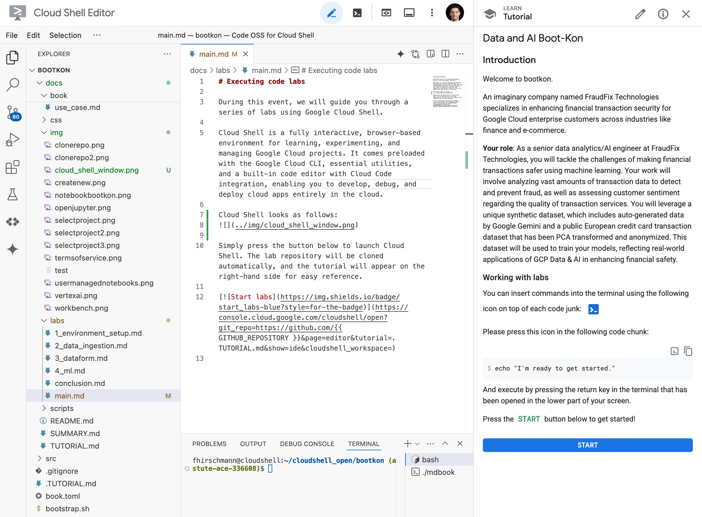
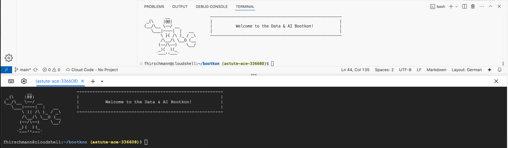
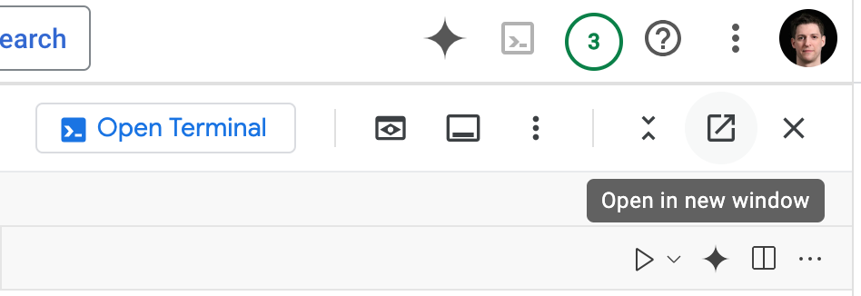
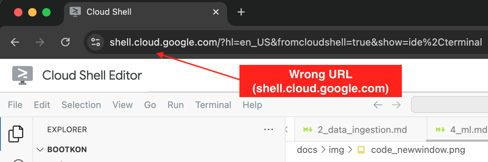
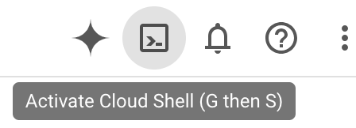
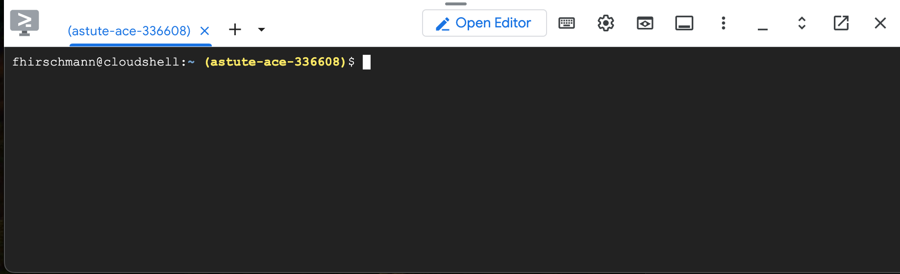

# Executing code labs

During this event, we will guide you through a series of labs using Google Cloud Shell.

Cloud Shell is a fully interactive, browser-based environment for learning, experimenting, and managing Google Cloud projects. It comes preloaded with the Google Cloud CLI, essential utilities, and a built-in code editor with Cloud Code integration, enabling you to develop, debug, and deploy cloud apps entirely in the cloud.

Below you can find a screenshot of Cloud Shell.



It is based on Visual Studio Code and hence looks like a normal IDE. However, on the right hand side you see the tutorial you will be working through. When you encouter code chunks in the tutorial, there are two icons on the right hand side. One to copy the code chunk to your clipboard and the other one to insert it directly into the terminal of Cloud Shell.

## Working with labs (important)

Please note the points in this section before you get started with the labs in the next section.

While going through the code labs, you will encounter two different terminals on your screen. Please only use the terminal from the IDE (white background) and do not use the non-IDE terminal (black background). In fact, just close the terminal with black background using the `X` button.



You will also find two buttons on your screen that might seem tempting. <font color="red">Please do not click the *Open Terminal* or *Open in new window* buttons</font> as they will destroy the integrated experience of Cloud Shell.



Please double check that the URL in your browser reads `console.cloud.google.com` and <font color="red">not `shell.cloud.google.com`</font>.



Should you accidentally close the tutorial or the IDE, just type the following command into the terminal:

```bash
bk-start
```

## Start the lab

In your Google Cloud Console window (see the [previous step](../book/getting_started.md)), activate Cloud Shell.



Click into the terminal that has opened at the bottom of your screen.



And copy & paste the following command and press return:

```bash
BK_REPO={{ BK_REPO }}; . <(wget -qO- https://raw.githubusercontent.com/{{ BK_REPO }}/main/.scripts/bk)
```

Now, please go back to Cloud Shell and continue with the tutorial that has been opened on the right hand side of your screen!
