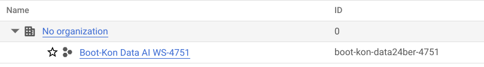
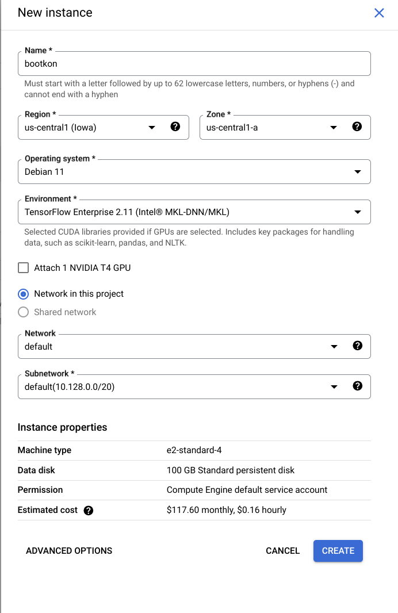
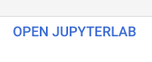
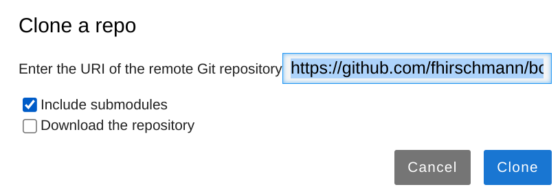

<walkthrough-metadata>
  <meta name="title" content="Data & AI Boot-Kon" />
  <meta name="description" content="These labs include detailed step-by-step instructions to guide you. In addition to the labs, you’ll face several challenges that you’ll need to solve on your own or with your group. Groups will be assigned by the event organizers at the start of the event." />
  <meta name="keywords" content="data, ai, bigquery, vertexai, genai, notebook" />
  <meta name="component_id" content="12345" />
</walkthrough-metadata>

<walkthrough-tutorial-duration duration="60"></walkthrough-tutorial-duration>
<walkthrough-tutorial-difficulty difficulty="3"></walkthrough-tutorial-difficulty>


# **\[Hands-on Lab \- 1\] Setup your environment**

# Follow Step by Step Instructions [here](https://docs.google.com/document/d/1RJcWKSmQ8-vLypuztkOlCCOfZcxIIgPu4v8wPpBmFhU/edit?usp=drive_link)


**Goal of the lab Enable Google cloud services APIs Ensure your GCP user and service account have access to the required resources. Create GCP default network  Create Vertex AI notebook for the ML labs.** |


CAUTION:  
This lab is for educational purposes only and should be used with caution in production environments. Google Cloud Platform (GCP) products are changing frequently, and screenshots and instructions might become inaccurate over time. Always refer to the latest GCP documentation for the most up-to-date information.

# **Architecture Diagram**

![alt architecture] (https://github.com/fhirschmann/bootkon-ng/blob/6fcd8053abcc77520380fbe05a47f2f99511634d/img/lab1/architecture.png)x

# **Choice of GCP Product and Service Location**

You are free to choose any GCP region location for all labs. Ensure all your resources are created in the chosen location to avoid connectivity issues and minimize latency and cost. If you don’t have a preferred GCP location, use ***us-central1*** for simplicity.

# **Setup your environment** 

1. Open Web Browser in **Incognito** Mode.  
2. Open [https://console.cloud.google.com](https://console.cloud.google.com)  
3. Login to your GCP console. Use the provided credentials.  
   1. Log in with your **gcp\_username** and **gcp\_password**.  
   2. **Accept** the Terms of Service   

      </img> 

   3. Choose your **project ID**: it should be **gcp\_project\_id** you received by **Email**. Click on select a project and select the project ID (example below)  
  </img>  
  </img> 
   </img>  
   4. Initially you have been granted the project editor and IAM project admin roles.

4. Click the **Cloud Shell** icon at the top right of the screen, it will open up a window at the bottom where you can execute commands in the next step. Click continue in the next window.  
   </img>  
5. Open this github repository in a new browser tab [https://github.com/fhirschmann/bootkon-h2-2024/blob/main/setup\_environment.sh](https://github.com/fhirschmann/bootkon-h2-2024/blob/main/setup_environment.sh)  
     
   This script **automates** the set up, including enabling APIs, cloning the repository, setting up IAM permissions, creating a VPC network, and copying files to GCS.  

   To use this script:

1. Download the script with the following command:

   ```bash
   `wget` \\
   `https://raw.githubusercontent.com/fhirschmann/bootkon-h2-2024/refs/heads`\\
   /`main/setup_environment.sh`

   ```

2. Make the script executable

   ```bash 
   `chmod +x setup_environment.sh`  
   ```

3. Run the script (takes around 3 minutes; may require you to copy an authentication token):

       `./setup_environment.sh <PROJECT_ID> <GCP_USERNAME> <REGION>`
      
   
   **`Example:`**

   `./setup_environment.sh bootkon-test24mun-8301 devstar8301@gcplab.me us-central1`
   
**Finally, we create a Vertex AI Notebook (JupyterLab)**

1. Go to Vertex AI in the GCP console.

   </img>  

2. Click on the Workbench section.

   </img>  

3. Select “User managed notebooks” 

   </img>  

4.  “Create new”

      </img>  

   

5. Name the notebook “***bootkon***” and leave the default network and environment. Leave the cheapest machine type; e2-standard-4 selected; 4 vCPUs and 16GB of RAM are more than enough to perform the ML labs using jupyter notebooks. Do not attach a GPU. Normally it takes around 10 minutes to get the instance created.

   </img>  

6. Open the Jupyter Lab;

   </img>  

7. From the Jupyter Lab top menu, click on Git \-\> Clone a Repository 

   </img>  

8. Enter [https://github.com/fhirschmann/bootkon-h2-2024.git](https://github.com/fhirschmann/bootkon-h2-2024.git) and click on **clone**

   </img>  

   

      **🥳Congratulations on setting up your environement 🥳**  
      **You can now move on to Lab 2**


# **\[Hands-on Lab \- 2\] Data Ingestion with BigLake**

Follow Step by Step Instructions [here](https://docs.google.com/document/d/1NAcQb9qUZsyGSe2yPQWKrBz18ZRVCL7X9e-NDs5lQbk/edit?usp=drive_link)

# **\[Hands-on Lab \- 3\] ELT with Dataform and LLM**

Follow Step by Step Instructions [here](https://docs.google.com/document/d/1NxfggQunrCn6ZfwGXAaA_lABDmXtRsfH88jkMDbqlJo/edit?usp=drive_link)

# **\<Lunch Time: 60 Minutes\>**

# **\[Hands-on Lab \- 4\] ML Operations with Vertex AI**

***Note: You can start Hands-on Lab 5 while the Hands-on Lab 4 training jobs in Notebooks 2 & 3 are still running.***  
Follow Step by Step Instructions [here](https://docs.google.com/document/d/1UdI1ffZdjy--_2xNmemQKzPCRXvCVw8JAroZqewiPMs/edit?usp=drive_link) 

# **\[Hands-on Lab \- 5\] Agent Builder and Gemini**

Follow Step by Step Instructions [here](https://docs.google.com/document/d/1_8-HEEIKCCUkwoorpWq8lOI3M1Rn6HqY4SlCW8AitGg/edit?usp=drive_link)

**\<Coffee Break: 30 Minutes\>**

# **Demo Data Canvas & Looker Studio**

No Instructions

**Architecture Challenge**  
No Instructions

To get started, click **Start**


# Tutorial title

<walkthrough-finish-button title="More solutions" tutorial="panels--sic--data-warehouse_toc"></walkthrough-finish-button>

## Introduction

Actual tutorial content would go here.

## Congrats!

You have now completed the tutorial for this solution!
